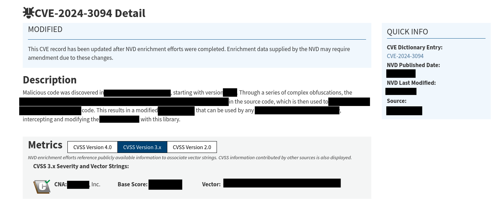
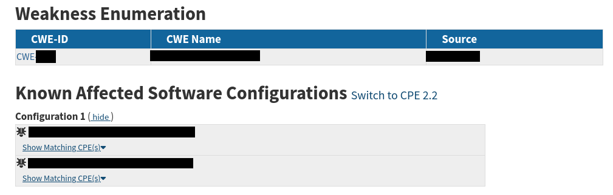

# Weak Password
**Category:** General Cybersecurity  
**Points:** 5  
**Difficulty:** Very Easy  

## 🛠️ Tools Used:
- NIST CVE Database

## 🚀 Solution:

### Step 1:
Prove you're a CVE expert by answering the following questions. Each question is based on the CVE ID CVE-2024-3094.

What is the name of the component affected by this CVE?
```
So when I saw this, I thought "Ok, so how do I find the CVE details?"
I went to the NIST NVD website (https://nvd.nist.gov/vuln/search#/nvd/home?resultType=records) and entered "CVE-2024-3094" in the search bar.

In the description of the CVE, I found the information requested:
```

```
So answer:
> [First censored bar]
```


### Step 2:
From which version does the CVE apply?
```
In the same page, I found that the affected version was:
> X.X.X 
```

### Step 3: 
In what year was the CVE discovered?
```
In the "Quick Info" on the right side, I found the year that the CVE was discovered.
> XX/XX/XXXX
```

### Step 4:
What is the CVSS score (version 3.1) associated with the CVE?

Note: Be sure to include the decimal value in the score (3.0, for example).
```
The CVSS score was under the "Base score" key, so the answer was:
> XX.X
```

### Step 5:
What is the CWE associated with the CVE?

(See [Notions - CWE](../Notions-CWE/) for more informations.)
```
To see the CWE of the related CVE, I simply scrolled down to the bottom of the page. (See below)
```

```
Therefore the answer was CWE-XXX
```

### Step 6:
Provide the CPE identification string associated with the CVE for version 5.6.0.
```
As seen above, the asociated CPE Identification associated with version 5.6.0 was under "Configuration 1" as the first bar.
> cpe:{cpe_version}:{part}:{vendor}:{product}:{version}:{update}:{edition}:{language}:{software_edition}:{target_software}:{target_hardware}:{other}
```