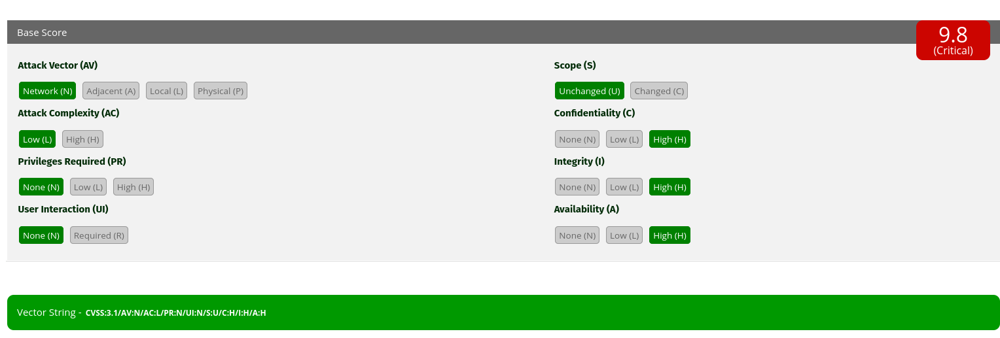

# Weak Password
---
**Category:** General Cybersecurity  
**Points:** 5  
**Difficulty:** Very Easy  

## 🛠️ Tools Used:
- FIRST CVSS Calculator

## 🚀 Solution:

### Step 1:
Prove you're a CVSS expert by answering the following questions.

Give the number of metric families available in a CVSS (version 3.1) scoring system.

```
The CVSS version 3.1 relies on 3 categories of metrics to calculate its final score:
```
- **Base Score**: this metric is the one that ranges from 0 tp 10, it represents the immutable characteristics of a vulnerability, it's also the most used score. It's calculated from 5 characteristics: the attack vector, the attack complexity, and the individual impact each component of the CIA triad (Confidentiality, integrity and availability).
- **Temporal Score**: this one reflects the characteristics of a vulnerability that evolves over time. Its score diminishes as patches or solutions become available for example.
- **Environmental Score**: This score is specific to the environment of the user. It makes one available to adjust the base score while keeping in mind the characteristics of one's environment, like  the presence of security measure (i.e: a firewall) which can modify the real impact of the vulnerability.

```
With that in mind, the answer was: 3
```

### Step 2:
What was the latest version of the CVSS score released as of September 2025?
> 4.0

### Step 3:
A CVSS (version 3.1) score of 7.0 is associated with what criticality level? Give it in capital letters.

> CVSS is classified into 4 different levels:
> - **LOW**: 0.0 to 3.9
> - **MEDIUM**: 4.0 to 6.9
> - **HIGH**: 7.0 to 8.9
> - **CRITICAL**: 9.0 to 10.0

Considering this, the answer was: HIGH

### Step 4:
In the "Base Score" metric family, give the name associated with the characteristic indicated by the letter 'C' in the CVSS (version 3.1) score, in lowercase and in English.

```
In CVSS, 'C' stands for Confidentiality, so the answer was:
> confidentiality
```

### Step 5:
Using the following CVSS vector: CVSS:3.1/AV:N/AC:L/PR:N/UI:N/S:U/C:H/I:H/A:H, provide the associated CVSS rating.

After reversing the CVSS calculator of FIRST for the base score (I could have just used the calculator but I was curious, the file is in https://www.first.org/_/cvsscalc31.js?20240610063942 by the way), I found it to be:
```javascript
// Calculates ISS impact sub-score
ISS = 1 - [(1 - Confidentiality) × (1 - Integrity) × (1 - Availability)]

// Calculates the impact
If Scope = Unchanged:
    Impact = 6.42 × ISS
Else:
    Impact = 7.52 × [(ISS - 0.029) - 3.25 × (ISS × 0.9731 - 0.02)^13]

// Calculates the exploitability
Exploitability = 8.22 × AV × AC × PR × UI

// Calculates the base score
If Impact <= 0: 
    Base Score = 0
Else If Scope = Unchanged:
    Base Score = RoundUp(Min[(Impact + Exploitability), 10])
Else:
    Base Score = RoundUp(Min[1.08 × (Impact + Exploitability), 10])
```

Now, all I had to do is plug in some values (Lucky me it was all in the same file):
```javascript
  // Attack Vector
  AV: {
    N: 0.85,  // Network
    A: 0.62,  // Adjacent Network
    L: 0.55,  // Local
    P: 0.2    // Physical
  },
  // Attack Complexity
  AC: {
    H: 0.44,  // High
    L: 0.77   // Low
  },
  // Privileges Required (depends on Scope)
  PR: {
    // Unchanged Scope
    U: {
      N: 0.85,  // None
      L: 0.62,  // Low
      H: 0.27   // High
    },
    // Changed Scope
    C: {
      N: 0.85,
      L: 0.68,
      H: 0.5
    }
  },
  // User Interaction
  UI: {
    N: 0.85,  // None
    R: 0.62   // Required
  },
  // Scope
  S: {
    U: 6.42,  // Unchanged
    C: 7.52   // Changed
  },
  // Confidentiality/Integrity/Availability Impact
  CIA: {
    N: 0,
    L: 0.22,
    H: 0.56
  }
```
After doing the calculations, I found 9,75311872, after rounding up to 9.8 I checked what the calculator said. And I was totally right! 
