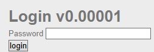

# HTML - Source Code
---
**Category:** Web-Server  
**Points:** 5  
**Difficulty:** Very Easy  
**Link:** https://www.root-me.org/en/Challenges/Web-Server/HTML-Source-code

## 📋 Description:
Don't search too far, an HTML challenge

## 🔍 Reconnaissance:
1. Opened the challenge page  

2. Right-clicked and selected "View Page Source"
3. Scanned through the HTML code and found relevant informations

## 🛠️ Tools Used:
- Web DevTools (Opera GX)

## 🚀 Solution:

### Step 1:
Press CTRL+U

### Step 2: 
Scan through the HTML code till you fall on a few commented lines, the password will be in those lines.
In a comment:
<!--
XXXXXXXXXXXXXXXXXXXX
-->

### Step 3:
Solve the challenge.

## 📌 References:
- [HTML Basics](https://repository.root-me.org/Programmation/XML%20-%20HTML/FR%20-%20HTML%20essentiel.pdf)
