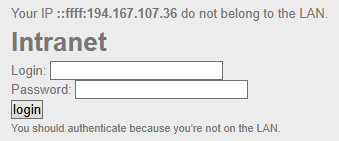

# HTTP - IP Restriction Bypass
---
**Category:** Web-Server  
**Points:** 10  
**Difficulty:** Very Easy  
**Link:** https://www.root-me.org/en/Challenges/Web-Server/HTTP-IP-restriction-bypass

## 📋 Description:
Only local users will be able to access the page

```bash
Dear colleagues,

We’re now managing connections to the intranet using private IP addresses, so it’s no longer necessary to login with a username / password when you are already connected to the internal company network.

Regards,
The network admin
```

## 🔍 Reconnaissance:
1. Opened the challenge page 

2. Right-clicked and selected "View Page Source"
3. Scanned through the HTML code but found nothing worthy except a hardcoded IPv6 address.

## 🛠️ Tools Used:
- Web DevTools (Opera GX)
- cURL

## 🚀 Solution:

### Step 1:
Open the command line on your operating system.

### Step 2: 
Use the <kbd>-H</kbd> option to enter the headers you want
```bash
curl -H "<A certain non-standard-header>: XXXXXX" http://challenge01.root-me.org/web-serveur/ch68/
```

### Step 3:
Extract the flag from the response.
```html
<!DOCTYPE html>
<html>
    <head>
        <title>Secured Intranet</title>
    </head>
    <body>
        <link rel='stylesheet' property='stylesheet' id='s' type='text/css' href='<TRUNCATED>' media='all'/>
        <iframe id='iframe' src='<TRUNCATED>'></iframe>
        <h1>Intranet</h1>
        <div>
            Well done, the validation password is: XXXXX
        </div>
    </body>
</html>
```

### Step 4:
Solve the challenge.

## 📌 References:
- [cURL man page](https://linux.die.net/man/1/curl)
- [MDN HTTP Non-standard Headers](https://developer.mozilla.org/en-US/docs/Web/HTTP/Reference/Headers#non-standard_headers)
- [RFC 1918 - Private Address Space](https://datatracker.ietf.org/doc/html/rfc1918#section-3)