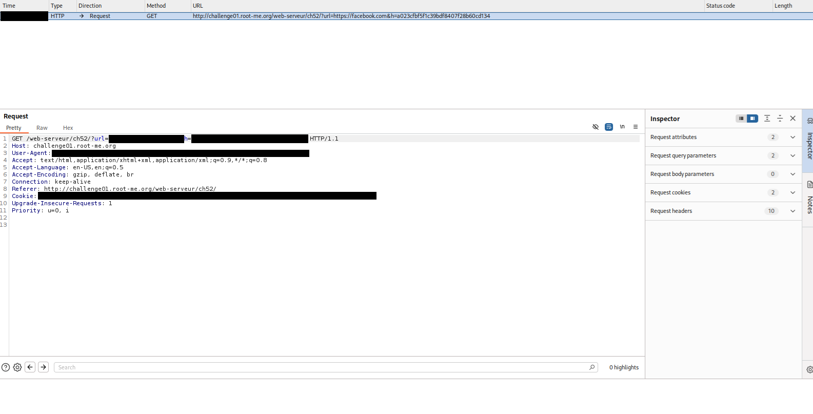

# HTTP - Open redirect
**Category:** Web-Server 
**Points:** 10
**Difficulty:** Very Easy  
**Link:** https://www.root-me.org/en/Challenges/Web-Server/HTTP-IP-restriction-bypass

## 📋 Description:
Internet is so big, the point is to find a way to make a redirection to a domain other than those showed on the web page.

## 🔍 Reconnaissance:
1. Opened the challenge page 

2. CTRL+U
3. Scanned through the HTML code and saw links towards external websites in the format:
?url=<website>&h=<Hex looking value>

## 🛠️ Tools Used:
- Web DevTools (Opera GX)
- Burpsuit
- CyberChef

## 🚀 Solution:

### Step 1:
Identifying what "h" is. At first glance it looked like an hex value so I used Cyberchef to decode the hex into text but it gave nothing worth.

So I used an hash identfier tool called "hashid" (See [Cryptanalysis.md](../../../ressources/Cryptanalysis-Ressources.md))
```bash
└─$ hashid -e HASH
Analyzing 'HASH'
<TRUNCATED>
[+] <HASH>
</TRUNCATED>
```

From this, I knew the hash was <HASH format>.

### Step 2: 
Next, I just had to somehow change the redirection value to my own.

For this I used burpsuit:


I just had to change the "?url=" and "&h=" values to what I wanted, so I hashed "A" into <HASH format> format, put "A" in the URL parameter and the hash into the "h" parameter.

?url=A&h=7fc56270e7a70fa81a5935b72eacbe29

### Step 3:
Extract the flag from the response. 
<p>
    Well done, the flag is XXXXXXX
</p>
<script>
    document.location = 'A';
</script>

### Step 4:
Solve the challenge.

## 📌 References:
- [Open Redirect](https://www.trustwave.com/en-us/resources/blogs/spiderlabs-blog/understanding-and-discovering-open-redirect-vulnerabilities/)
- [Burpsuit](https://portswigger.net/burp)