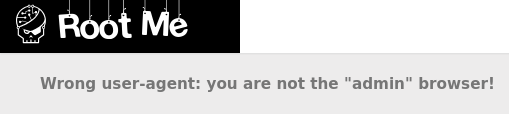

# HTTP - User-agent
**Category:** Web-Server | **Points:** 10 | **Difficulty:** Very Easy  
**Link:** https://www.root-me.org/en/Challenges/Web-Server/HTTP-User-agent

## 📋 Description:
"Admin is really dumb..."

The objective is to use the right User-Agent to access the page.

## 🔍 Reconnaissance:
1. Opened the challenge page 

2. CTRL+Shift+E et CTRL+R
3. Scanned through the HTTP headers and cookies

## 🛠️ Tools Used:
- Web DevTools (Opera GX)

## 🚀 Solution:

### Step 1:
My first thought when I landed on the page was, "How do I change my user-agent so that it's 'admin'?"

I also thought, "What is a user-agent? Why is it needed? And how is it caracterized?"

A user-agent is sort of an identifier. It identifies a browser, an operating system, a device type. For example:
Mozilla/5.0 (X11; Linux x86_64; rv:128.0) Gecko/20100101 Firefox/128.0

Originally, user-agents were used for server delivery to optimize content for a specific browser or device. (Giving a mobile website to mobile browsers, sending different HTML/CSS in case a browser doesn't support some features, Analytics and of course security filtering (blocking bots))

According to RFC2616, user-agent is formatted like: User-Agent = "User-Agent" ":" 1*( product | comment ).

Nowadays for browsers, it's often: 
User-Agent: <browser_name>/<version> (<system-information>) <platform> (<platform-details>) <extensions>

### Step 2: 
The way I tried to do it is by using DevTools.

By going into the Network Tab and clicking on "+" New request, I made a new request with a GET request to the URL of the challenge.

In the headers, I input User-agent as the key and admin as the value then I sent the request.

The response was:

Welcome master!
Password: XXXXXXXX

### Step 3:
Solve the challenge.

## 📌 References:
- [User-agent header wikipedia](https://en.wikipedia.org/wiki/User-Agent_header)
- [User-agent header MDN](https://developer.mozilla.org/en-US/docs/Web/HTTP/Reference/Headers/User-Agent)