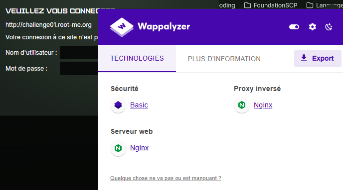

# Weak Password
**Category:** Web-Server 
**Points:** 10
**Difficulty:** Very Easy  
**Link:** https://www.root-me.org/en/Challenges/Web-Server/Weak-password

## 📋 Description:
Nothing too difficult

## 🔍 Reconnaissance:
1. Used Wappanalyzer to identify the technologies in the website.

## 🛠️ Tools Used:
- Wappanalyzer

## 🚀 Solution:

### Step 1:
Seeing as the technology behind the website was nginx and the challenge was named "Weak password", I decided to search for default credentials for XXX online. On a website listing default credentials for various software, I found that the default username and password for XXX was x/y.

### Step 2: 
I input the credentials into the input fields.

### Step 3:
Solve the challenge.